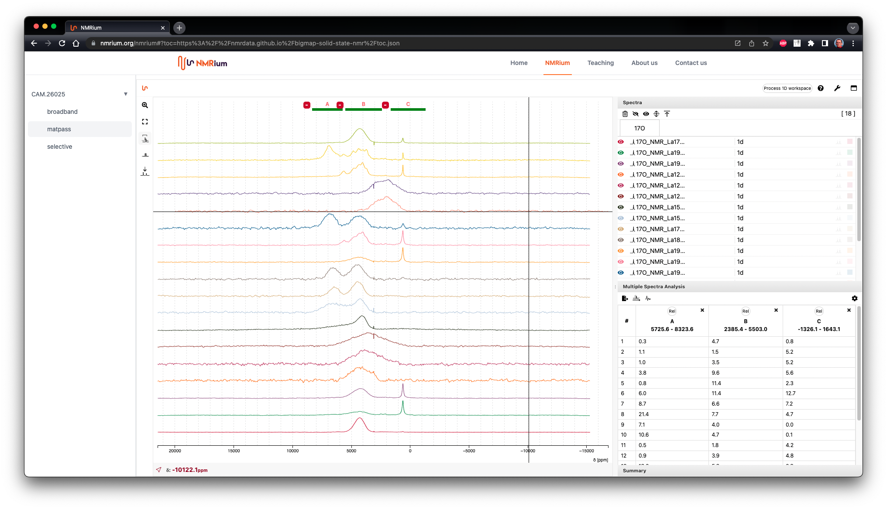
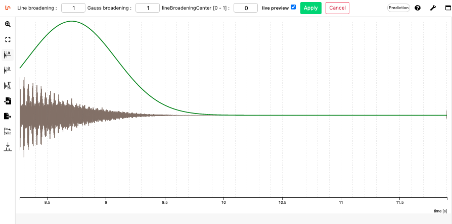
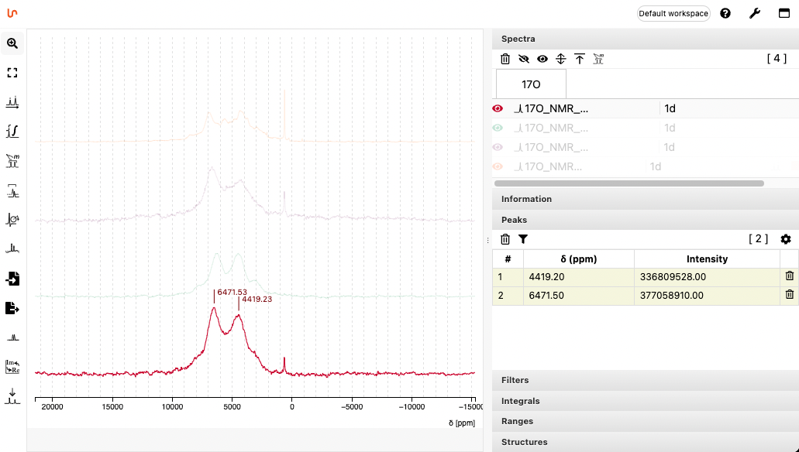

# Solid state NMR visualization

## Short summary

The goal of this project is to provide an open source microservice (app) for the processing, visualization and analysis of solid-state NMR spectra accessible via a modern web front-end (React).

The project is open-source (MIT license) and is available on [https://git.nmrium.org](https://git.nmrium.org). An exhaustive documentation can be found on [https://docs.nmrium.org](https://docs.nmrium.org).

In order to show the possibilities, we provide here a solid state NMR dataset coming from the following publication:

Halat, D., Dunstan, M., Gaultois, M., Britto, S., & Grey, C. (2018). Research data supporting "Study of defect chemistry in the system La 2- Sr NiO 4+ by 17 O solid-state NMR spectroscopy and Ni K-edge XANES" [https://doi.org/10.17863/CAM.26025](https://doi.org/10.17863/CAM.26025).

It can be previewed from this link [https://www.nmrium.org/nmrium#?toc=https%3A%2F%2Fnmrdata.github.io%2Fbigmap-solid-state-nmr%2Ftoc.json](https://www.nmrium.org/nmrium#?toc=https%3A%2F%2Fnmrdata.github.io%2Fbigmap-solid-state-nmr%2Ftoc.json).



## General overview of the features

### From the FID

NMRium allows to load native 1D data from Bruker (Zip file), Varian and Jeol as well as the JCAMP-DX file format. Either the FID or the FT file can be loaded.

From the FID the following operations can be done

- Apodization (Line broadening, Gauss broadening, Center for line broadening)
- Zero filling
- Fourier transform



### Analyze the spectrum

A tool allows to make peak picking and to reference the spectrum if required.



### Exportation

The image of the spectrum can be copied using <kbd>CTRL</kbd><kbd>C</kbd> but can also be downloaded to the native `.nmrium` format (for further processing) or as a svg to create high quality reports.

## Integration if your own system

There are various ways to integrate NMRium in your own system, from a close integration using the React component to a simple link to www.nmrium.org.

### Integration in your own React website

`NMRium` is published on `npm` and can be installed using:

`npm i nmrium`

It can then be included in your `jsx` component using the following syntax:

```jsx
import NMRium from "nmrium";

function MyComponent() {
  return <NMRium />;
}
```

More information about loading the data from a `prop` and using the numerous options can be found on [https://docs.nmrium.org/for-developers/include-react-component](https://docs.nmrium.org/for-developers/include-react-component).

### Visualization of spectra on [https://www.nmrium.org/nmrium](https://www.nmrium.org/nmrium)

The website [https://www.nmrium.org/nmrium](https://www.nmrium.org/nmrium) provides a demonstration of NMRium component. On this page you are able either to drag and drop a list of JCAMP-DX or a zip file containing native Bruker files.

The use of NMRium is extensively described on [https://docs.nmrium.org](https://docs.nmrium.org).

### Opening directly your spectra from your ELN on [https://www.nmrium.org](https://www.nmrium.org)

The website [www.nmrium.org](https://www.nmrium.org/) is able to load a Table Of Contents (TOC) as a JSON file.

If order to have a menu on the left containing many group of spectra you should create a correctly formatted `.json` file. In this case the URL to this JSON file has the following structure:

<kbd>https://www.nmrium.org/nmrium</kbd><kbd>#?json=</kbd><kbd>jsonURL</kbd>

The `jsonURL` must be accessible using Ajax (take care about cross-origin and https). This file could be generated dynamically directly from a database.

Here is an example of the content of the `toc.json` file:

```json
[
  {
    "groupName": "CAM.26025",
    "folderName": "CAM.26025",
    "children": [
      {
        "id": "f3oJnR1zqfNNffI0Urjkf1oZifc=",
        "file": "./CAM.26025/broadband/index.json",
        "title": "broadband",
        "selected": true
      },
      {
        "id": "gcVdupbPgszMCpSM3lPoS/AcG3c=",
        "file": "./CAM.26025/matpass/index.json",
        "title": "matpass"
      },
      {
        "id": "t87E7IvM5VKHAEjtX1Q2HCB23d4=",
        "file": "./CAM.26025/selective/index.json",
        "title": "selective"
      }
    ]
  }
]
```

The `file` attribute will contain the relative link to an NMRium file (encodes as a JSON) that describes the set of JCAMP-DX to load. Here is for example the content of the file `./CAM.26025/broadband/index.json`:

```json
{
  "spectra": [
    {
      "source": {
        "jcampURL": "./17O_NMR_La17Sr03NiO4_broadband-spinecho.dx"
      },
      "display": {
        "name": "17O_NMR_La17Sr03NiO4_broadband-spinecho.dx"
      }
    },
    {
      "source": {
        "jcampURL": "./17O_NMR_La18Sr02NiO4_broadband-spinecho.dx"
      },
      "display": {
        "name": "17O_NMR_La18Sr02NiO4_broadband-spinecho.dx"
      }
    },
    {
      "source": {
        "jcampURL": "./17O_NMR_La19Sr01NiO4_broadband-spinecho.dx"
      },
      "display": {
        "name": "17O_NMR_La19Sr01NiO4_broadband-spinecho.dx"
      }
    },
    {
      "source": {
        "jcampURL": "./17O_NMR_La2NiO4_broadband-spinecho.dx"
      },
      "display": {
        "name": "17O_NMR_La2NiO4_broadband-spinecho.dx"
      }
    }
  ]
}
```

This example can be tested here:
[https://www.nmrium.org/nmrium#?toc=https%3A%2F%2Fcheminfo.github.io%2Fnmr-dataset3%2Fmultiplet%2Findex.json](https://www.nmrium.org/nmrium#?toc=https%3A%2F%2Fcheminfo.github.io%2Fnmr-dataset3%2Fmultiplet%2Findex.json)

More information can be found on [https://docs.nmrium.org/for-developers/using-nmrium#loading-a-table-of-contents](https://docs.nmrium.org/for-developers/using-nmrium#loading-a-table-of-contents).

## Creating your own TOC from command line

We have developed a utility that simplifies the process of creating a static set of spectra and the toc.json file.

The principle is quite simple, you create folders containing jcamp files (extension `dx` or `jdx`) and optionally a molfile (extension `.mol`).

If you have [node](https://nodejs.org/en/) installed, execute the following instructions to generate the correct json files:

```bash
npm i --global nmrium-cli
nmrium createGeneralTOC
```

This command will generate the required `toc.json` file as well as the corresponding `.json` in each folder. If this `toc.json` is accessible from a URL it can be loaded by NMRium as explained above.

## Future developments

While NMRium fulfill the requirements to visualize and process solid state NMR spectra, more tools can always be implemented and could be part of another project.

In particular we would like to focus on:

- peak shape analysis
- multi spectra analysis and difference in spectra
- reference database for quick and easy comparison of other spectra

## Acknowledgements

This project has received funding from the European Union’s [Horizon 2020 research and innovation programme](https://ec.europa.eu/programmes/horizon2020/en) under grant agreement [No 957189](https://cordis.europa.eu/project/id/957189).
